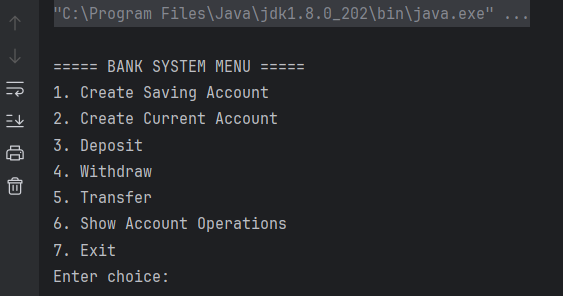

#  BanqueApp - Banking Account Management (Java 8)

##  Overview
BanqueApp is a **console-based banking application** developed in **Java 8**.  
It allows automated management of bank accounts and transactions such as deposits, withdrawals, and transfers.

---

##  Architecture

###  Package Structure
```
src/
 ├── controllers/
 │    ├── AccountController.java
 ├── model/
 │    ├── BankAccount.java (abstract)
 │    ├── CurrentAccount.java
 │    ├── SavingAccount.java
 │    ├── Operation.java (abstract)
 │    ├── Deposit.java
 │    └── Withdraw.java
 └── Main.java
```

##  Business Model

### Abstract Class `BankAccount`
- **Attributes**
    - `String code` → unique account code (format `CPT-XXXXX`)
    - `String username` → client username
    - `float sold` → account balance
    - `List<Operation> operations` → list of performed operations

- **Abstract Methods**
    - `void deposit(float amount)`
    - `void withdraw(float amount)`

---

### `CurrentAccount`
- **Extra attribute** : `float overdraft`
- **Withdrawal Rule** : balance ≥ `-overdraft`.
- **Interest** : always `0`.

---

### `CompteEpargne` (Savings Account)
- **Extra attribute** : `float interestRate`.
- **Withdrawal Rule** : balance ≥ withdrawal amount.
- **Interest Calculation** : based on `interestRate`.

---

### Abstract Class `Operation`
- **Attributes**
    - `UUID numero` → unique identifier
    - `LocalDateTime date` → operation date/time
    - `float amount` → transaction amount
    - `String type` → transaction type

---

##  Features
-  Create account (current or savings)
-  Deposit into account
-  Withdraw from account
-  Transfer between accounts (reuses deposit & withdrawal logic)
-  Check account information and list operations

---

##  Console Menu


---